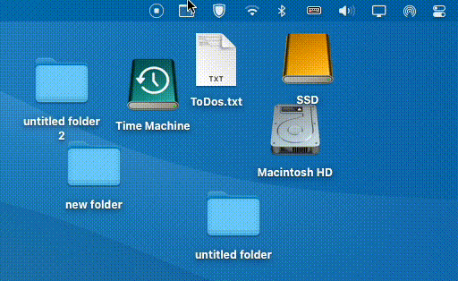

# Camo

Camo stands for `Camouflage`! It’s a small menu bar app for macOS that allows you to quickly hide or show your desktop files. It’s useful if you have a client meeting or presentation where the mess of your desktop is exposed to people you want to impress. 🙃
